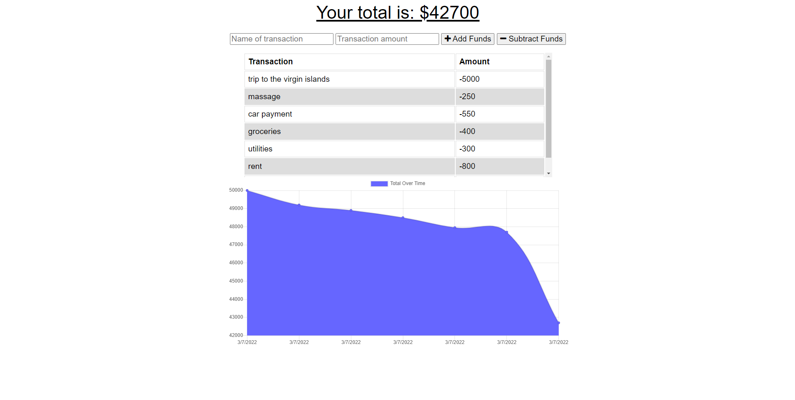

# 19-PWA-Budget-Tracker

  ## Table of Contents
  * [Return to Top](#)
  * [Application Description](#application-description)
  * [Application Dependencies](#application-dependencies)
  * [How to Use](#how-to-use)
  * [Application Built With](#application-built-with)
  * [Screenshot](#screenshot)
  * [Deployed Application](#deployed-application)
  * [Github Repo Location](#github-repo-location)
  * [Contact](#contact)
  
  ## Application Description
  This application was designed to help you track your budget and expenses.
  
  ## Application Dependencies
  * Node.js 
  * Mongoose
  * Express
  * MongoDB
  * Moment
  
  ## How to Use
  You can use this application by checking the deployed application
  

  ## Application Built With
  * Node.JS
  * Express
  * MongoDB
  * Mongoose
  * Javascript
  
  ## Screenshot
  

  ## Deployed Application
  [Click Here](https://intense-reaches-58729.herokuapp.com)
  
  ## Github Repo Location
 [https://github.com/DSiedlarz90/18-Social-Media-API](https://github.com/DSiedlarz90/18-Social-Media-API)

  ## Contact
  Email: Dsiedlarz90@gmail.com